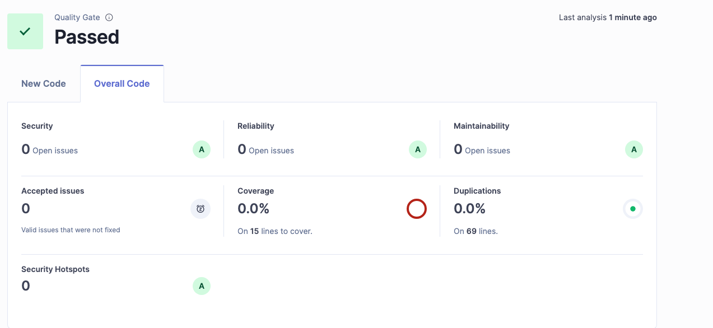

## Student Information

First Name: Jessie

Last Name: Hallie

Student number: 500894603

## Assignment 1

### 1. Git log

```
Place here the results of the following command: git log --pretty=format:"%hx %ad%x09%s" --date=short`

d9f1cf9 2025-09-14      test: added more tests and adjusted names
1d0abfc 2025-09-14      feat: implemented complete BSN validation
571c239 2025-09-14      test: add failing BSN validation tests
ce1f4ab 2025-09-14      chore: initial projekt setup - created basic test class - added empty bsnvalidator class
33f0778 2025-09-13      Initial commit
```

### 2. Sonarqube

A dated screenshot of the overview of the following  quality gates(https://docs.sonarqube.org/latest/user-guide/quality-gates/): Reliability, Security,Maintainability, Coverage and Duplications. Provide a short discussion of the results.



### 3. Test Driven Development

Your best test class code snippets with a rationale why the unit tests are “good” tests.  Provide a link to the Test class and the class under test in Git.

```java
@Test
public void shouldAcceptValidBsn() {
    BsnValidator validator = new BsnValidator();
    assertTrue("123456782 should be valid", validator.isValid("123456782"));
}

@Test
public void shouldRejectBsnWithSpecialCharacters() {
    BsnValidator validator = new BsnValidator();
    assertFalse("12345678! should be invalid", validator.isValid("12345678!"));
    assertFalse("12345678@ should be invalid", validator.isValid("12345678@"));
    assertFalse("12345678# should be invalid", validator.isValid("12345678#"));
    assertFalse("12345678$ should be invalid", validator.isValid("12345678$"));
}

@Test
public void shouldRejectBsnWithSpaces() {
    BsnValidator validator = new BsnValidator();
    String[] invalidBsns = { "123 456 78", " 12345678", "12345678 " };
    
    for (String bsn : invalidBsns) {
        assertFalse(bsn + " should be invalid", validator.isValid(bsn));
    }
}

@Test
public void shouldRejectNullBsn() {
    BsnValidator validator = new BsnValidator();
    assertFalse("null should be invalid", validator.isValid(null));
}

@Test
public void shouldRejectEmptyBsn() {
    BsnValidator validator = new BsnValidator();
    assertFalse("empty string should be invalid", validator.isValid(""));
}
```

**Rationale why these are "good" tests:**

1. **Comprehensive Coverage**: Tests cover all major scenarios including valid BSNs, invalid BSNs, edge cases (null, empty), and error conditions (special characters, spaces).

2. **Clear Test Names**: Method names clearly describe what is being tested (shouldAcceptValidBsn, shouldRejectBsnWithSpecialCharacters).

3. **Descriptive Assertions**: Each assertion includes a descriptive message explaining what should happen, making debugging easier.

6. **Isolated Tests**: Each test is independent and can run in any order without affecting other tests.

7. **Efficient Testing**: The spaces test uses a loop to test multiple similar cases efficiently.

[BsnValidator Class](https://gitlab.fdmci.hva.nl/se-specialization-25-26-semester-1/tse2/jessie-hallie/workshop-2-bsn/-/blob/main/bsn-validator/src/main/java/nl/bsn/validator/BsnValidator.java)

[BsnValidatorTest Class](https://gitlab.fdmci.hva.nl/se-specialization-25-26-semester-1/tse2/jessie-hallie/workshop-2-bsn/-/blob/main/bsn-validator/src/test/java/nl/bsn/validator/BsnValidatorTest.java)

### 4. Code Reviews

Screenshots of the code reviews you have performed on code of another student as comments in Gitlab: Provide a link to the comments in Gitlab.

https://gitlab.fdmci.hva.nl/se-specialization-25-26-semester-1/tse2/hamza-zaraoui/tdd-palindrome-assignment/-/blob/main/CODEREVIEW.md?ref_type=heads

https://gitlab.fdmci.hva.nl/se-specialization-25-26-semester-1/tse2/hamza-zaraoui/bsn-assignment/-/blob/main/CODE_REVIEW.md?ref_type=heads

